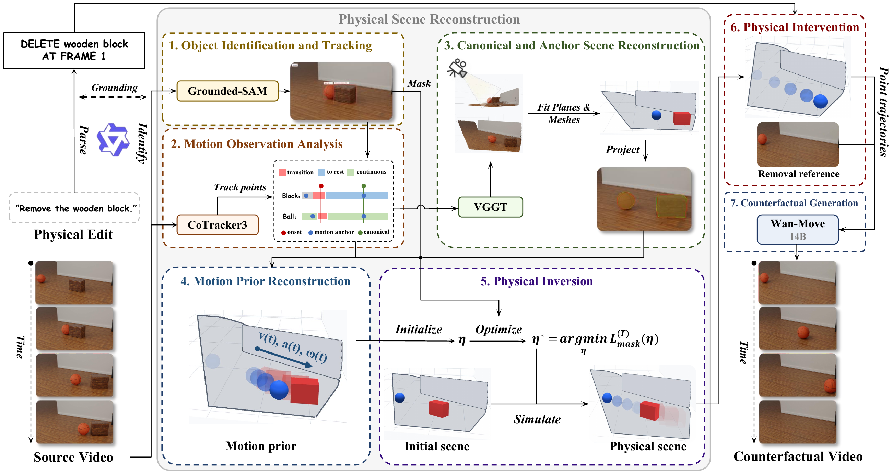

<h1 align="center">
  VideoPhysEdit: Physical Counterfactual Video Editing<br>
  via Rigid-Body Physical Scene Reconstruction
</h1>

<p align="center">
  <a href="mailto:chyue25@m.fudan.edu.cn" title="Email Conghan Yue">Conghan Yue</a>, Yuanjie Chen, Yue Han, Ya Gao, Yunyan Xiao, WeiYao Zhang, Zhineng Chen<sup>†</sup><br>
  Institute of Trustworthy Embodied AI, Fudan University<br>
  <picture></picture>
</p>

<p align="center">
  <picture></picture>
  &nbsp;&nbsp;&nbsp;
  <picture></picture>
</p>

<p align="center">
  <a href="https://arxiv.org/abs/2609.35134"></a>
  <a href="https://videophysedit.github.io/"></a>
  <a href="https://huggingface.co/datasets/ccmoony/PCVE-RigidBench"></a>
  <a href="https://github.com/Hammour-steak/PCVE-RigidBench"></a>
</p>

Official repository for **VideoPhysEdit**, a training-free pipeline for physical counterfactual video editing in rigid-body scenes.

Given a source video, a physical edit, and its execution frame, VideoPhysEdit generates a counterfactual video depicting the resulting motion and interactions. It reconstructs an executable physical scene that explains the observed motion, applies the edit in simulation, and uses the resulting trajectories to guide video generation. Supported edits include object insertion, object removal, and changes to physical parameters.

## Pipeline



## Code

**Code coming soon.** We are preparing the implementation and usage instructions for release.

## Benchmark

PCVE-RigidBench provides paired source and counterfactual target videos and physical ground truth for physical counterfactual video editing. Download the dataset from [Hugging Face](https://huggingface.co/datasets/ccmoony/PCVE-RigidBench) and find the evaluation tools in the [benchmark repository](https://github.com/Hammour-steak/PCVE-RigidBench).

## Citation

If you find this work useful, please cite:

```bibtex
@misc{yue2026videophysedit,
  title={VideoPhysEdit: Physical Counterfactual Video Editing via Rigid-Body Physical Scene Reconstruction},
  author={Conghan Yue and Yuanjie Chen and Yue Han and Ya Gao and Yunyan Xiao and WeiYao Zhang and Zhineng Chen},
  year={2026},
  eprint={2609.35134},
  archivePrefix={arXiv},
  primaryClass={cs.CV},
  url={https://arxiv.org/abs/2609.35134}
}
```
